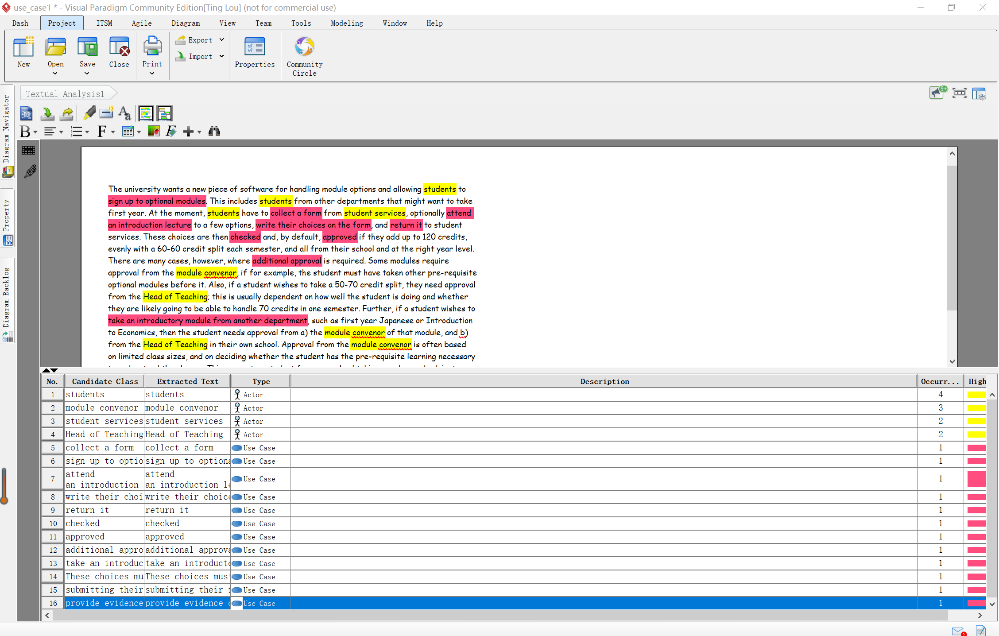
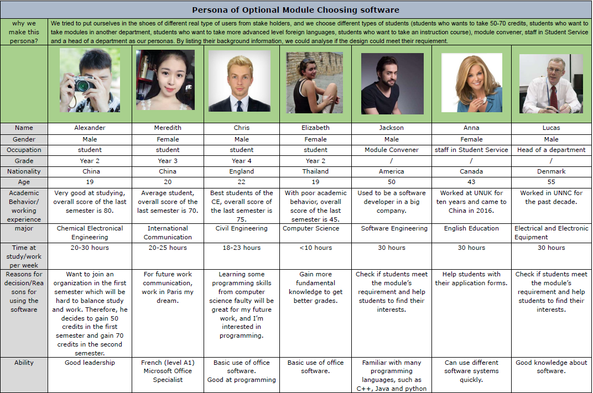
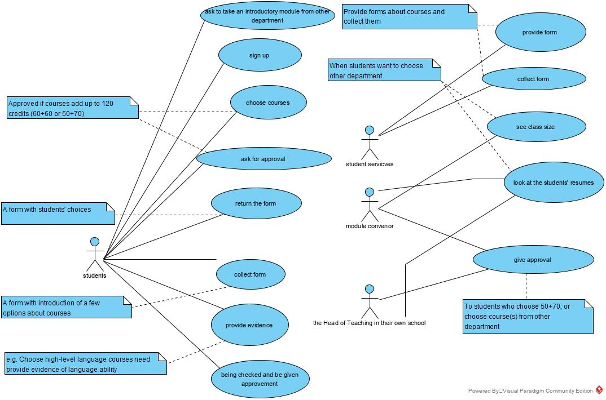

# Documentation of week 1

### 1. Textual analysis

### 2. Personas

### 3. Use case diagram

### 4. What we learn from the textual analysis

a) Our goal is to find the actor and the corresponding use case. So at the beginning we read and found every objects in textual analysis, and find the demand or supply from these objects. We should be careful to highlight every object in case we miss some of them. And then we need to consider whether or not some of these objects will be deleted because of repetition or other factors. (about our experience form doing textual analysis)

b) And after doing this textual analysis, we remain all of these useful actors and the corresponding use cases, so we can extract it and it gives us a clear frame for the Use Case Diagram. (about the benefit from doing textual analysis)

### 5. Stakeholder analysis

[Stakeholder analysis]:

[stakeholder analysis]: ./StakeholderAnalysis.md

### 6. The details of Personas

We tried to put ourselves in the shoes of different real type of users from stake holders, and we choose different types of students (students who wants to take 50-70 credits, students who want to take modules in another department, students who want to take more advanced level foreign languages, students who want to take an instruction course), module convener, staff in Student Service and a head of a department as our personas. By listing their background information, we could analyse if the design could meet their requirement.