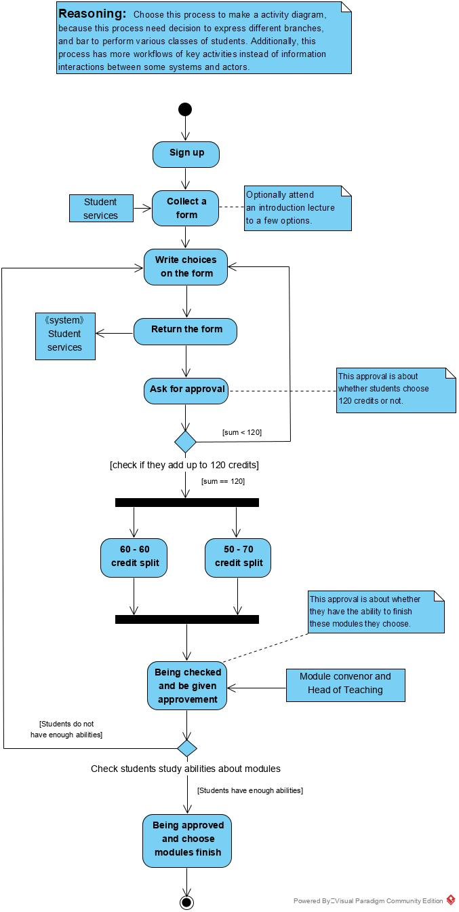
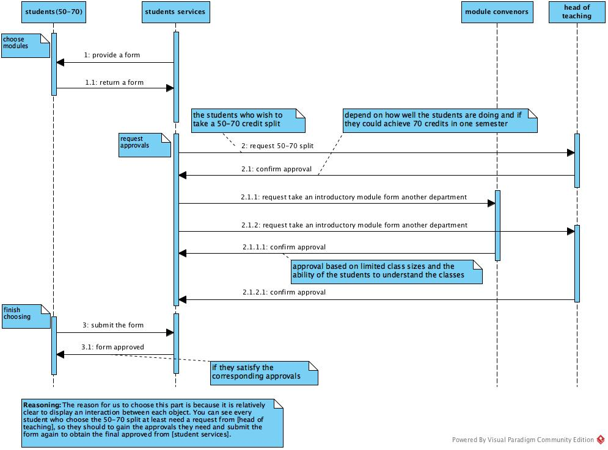
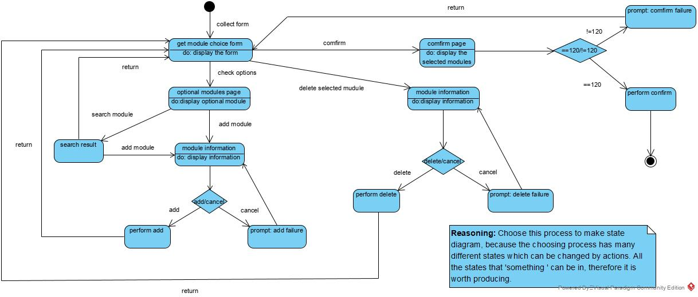

# Lab 03 Report 

[TOC]

## Introduction

- In today's lab, we worked together and achieved four objectives below:		
  - Make Activity Diagram & Sequence Diagram using Visual Paradigm and added some notes.
  - Do optional State Diagram using Visual Paradigm and added some notes.
  - Create this markdown report including pictures of these diagrams.
  - Tag our repository at the end with tag <Lab03_Final>.

------

## Contents (UML Diagrams)

#### Activity Diagram

- ##### Reasonings for producing

  Choose this process to make a activity diagram, because this process need decision to express different branches, and bar to perform various classes of students. Additionally, this process has more work-flows of key activities instead of information interactions between some systems and actors.

- ##### Image of the diagram

  

  

#### Sequence Diagram

- ##### Reasonings for producing

  The reason for us to choose this part is because it is relatively clear to display an interaction between each object. You can see every student who choose the 50-70 split at least need a request from [head of teaching], so they should to gain the approvals they need and submit the form again to obtain the final approved from [student services].

- ##### Image of the diagram

  

#### State Diagram

- ##### Reasonings for producing

  Choose this process to make state diagram, because the choosing process has many different states which can be changed by actions. All the states that 'something ' can be in, therefore it is worth producing.

- ##### Image of the diagram

