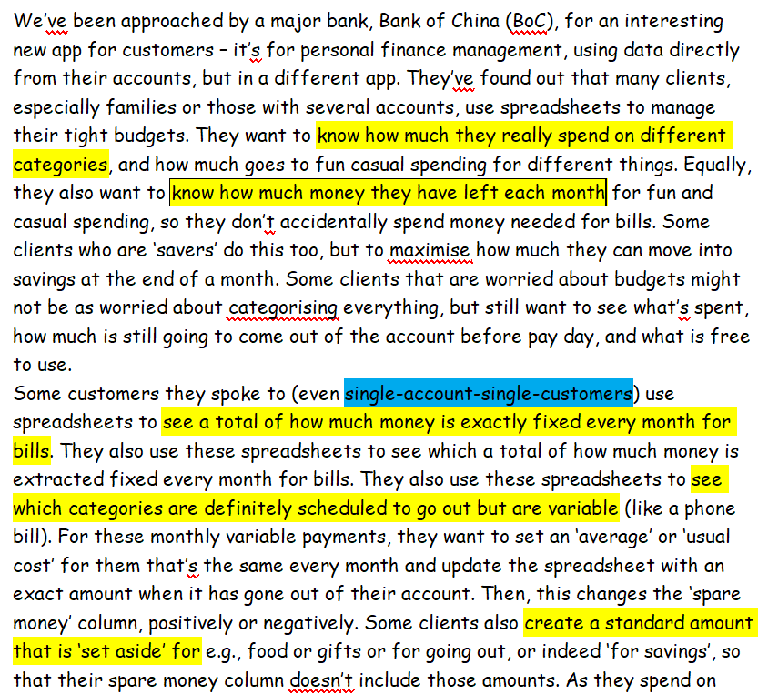
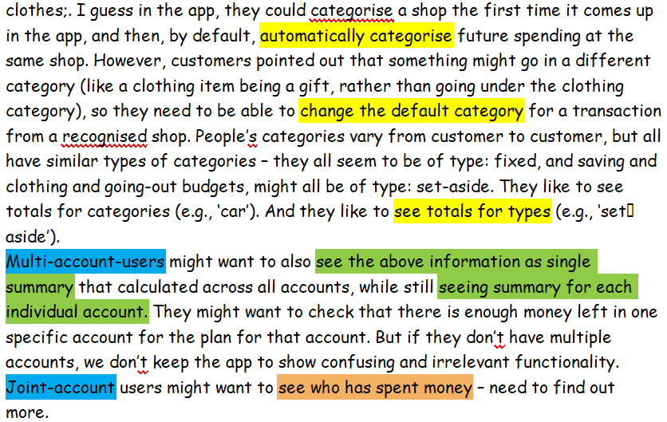
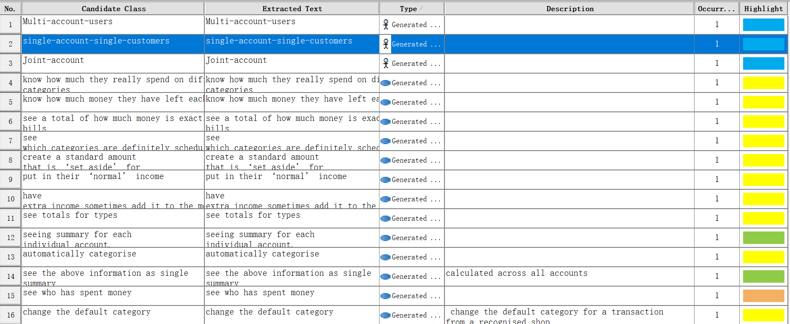
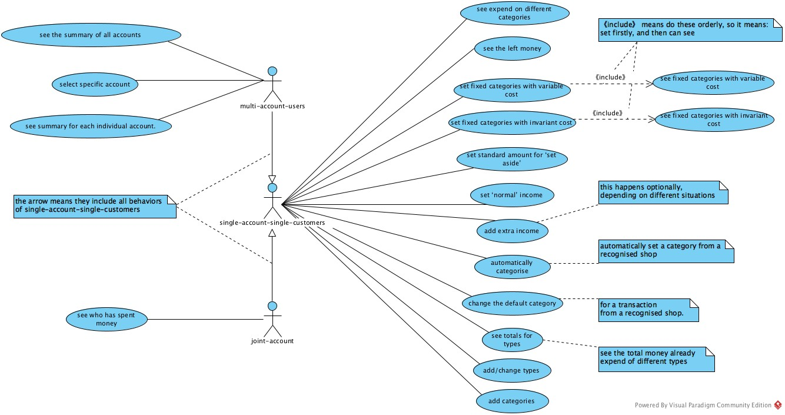

# Lab 04 Report

### Outline

- [Introduction](#introduction)
- [Distributions](#distributions)
- [Textual Analysis](#textual-analysis)
- [Use Case Diagram](#use-case-diagram)
- [User Stories](#user-stories)
- [Reasoning for choices](#reasoning-for-choices)
- [Questions for Harvey](#questions-for-harvey)

------

### Introduction

In this week's lab, we worked together to help Harvey for a new app (personal finance management),and achieved four objectives below:		

- Make Textual Analysis, Use Case Diagram and User Stories using Visual Paradigm 
- Add some notes and give reasons for our choices.
- Create this markdown report including all of our affords.
- Tag our repository at the end with tag <Lab04_Final>.

### Distributions

| No.  | Content                               | Main Contributor |
| ---- | ------------------------------------- | ---------------- |
| 1    | Textual Analysis& Use Case Diagram    | Ting Lou         |
| 2    | User Stories                          | Yanbing Luo      |
| 3    | Notes for Use Case Diagram& Questions | Linglong Hu      |
| 4    | Explanation for Use Case Diagram      | Yixin Shen       |
| 5    | Reasoning& Documentation              | Gaole Dai        |

### Textual Analysis

Text analysis:

Simple explanation of each highlighters:

- **Blue**: Actors (Single-account-single-customers, Multi-account-users, Joint-account);
- **Yellow**: Use case (for all actors);
- **Green**: Use case (for Multi-account-users);
- **Orange**: Use case (for Joint-account).

Extracted text:

### Use Case Diagram

The actors identified were:

- ##### **Single-account-single-customers**

  - This kind of actor is the **basic actor** of the system.
  - Should be able to ***set 'normal' income*** and ***add 'extra' income***.
  - Should be able to ***set fixed categories with variable/invariant cost*** and <u>after setting</u> actor should be able to ***see fixed categories with variable/invariant cost***
  - Should be able to ***add/change types*** and ***see totals for types***.
  - Should be able to ***change the default category***, ***add new categories***  , ***automatically categorise*** and ***know how spend on different categories***.
  - Should be able to ***set standard amount for 'set aside'*** and ***see the left money***.

- ##### **Multi-account-users**

  - This kind of actor can do everything a single-account-single-customers can do.
  - Additionally: 
    - should be able to ***see the summary of all accounts***.
    - should be able to ***select specific account*** and ***see summary for each individual account***.

- ##### **Joint-account**

  - This kind of actor can do everything a single-account-single-customers can do.
  - Additionally:
    - should be able to ***see who has spent money***.

### User Stories

- As a representative of many clients, especially families or those with several accounts, I want to know how much I really spend on different categories, so that I can manage my tight budgets.

- As a representative of many clients, especially families or those with several accounts, I also want to know how much money I have left so that I don't accidentally spend money needed for bills.

- As a 'savers', I want to know how much money I have left so that I can maximise how much I can move into savings at the end of a month.

- As a customer, I want to see a total of how much money is exactly fixed every month for bills so that I can subtract them from my total income.

- As a customer, I want to see which categories are definitely scheduled to go out but are variable so that I can compare the costs of this type this month with the average.

- As a customer, I want to set an 'average' or 'usual cost' for which categories are definitely scheduled to go out but are variable so that I can know the spare money, positively or negatively.

- As a customer, I want to create a standard amount that is 'set aside' for so that their spare money column doesn't include those amounts.

- As a customer, I want to put in my 'normal' and extra income into the spreadsheet so that I can know how much money I can use this month.

- As a customer, I want to use an app can categorise a shop the first time it comes up in the app and automatically categorise future spending at the same shop so that save the time about coping every expenditure and manually categorising it.

- As a customer, I want to change the default category for a transaction from a recognised shop so that I can correct the wrong categories which are given by the system.

- As a customer, I want to add different categories under types so that this spreadsheet can suit my own requirements.

- As a customer, I want to see totals for categories so that I can know how much money I exactly spend in this category.

- As a customer, I want to see totals for types so that I can know how much money I exactly spend in this type.

- As a multi-account-user, I want to see the above information as single summary that calculated across all accounts so that I can know the exactly totals of all accounts.

- As a multi-account-user, I want to see summary for each individual account so that I can know the exactly totals of one single account.

- As a joint-account, I want to see who has spent money so that I can know how my money have been spent and how much money did each person spent.

### Reasoning for Choices

We use Use Case Diagram and User Stories to initial analysis the idea from our manager Harvey,  and we decided to exclude the Persona. 

Our software is designed for clients from Bank of China to manage their personal finance, so the customers(users) vary from business men to high-school students. Aim at a broader audience,  especially those used to manage their tight budgets using spreadsheets. Our target audiences are quite different, they have different backgrounds, it's not that easy to categorise them, and different users don't have a fundamental impact on the requirement.  We think it's important to show our software more in functional aspect, rather than user's background.

Persona shows the background of representative users, it is designed to help understand the spectrum of goals and needs of our users, but from the requirement text provided by Harvey, the target audience and their requirements are quite clear.

Use Case Diagram shows a clear view of different tasks that three actors will do, it displays the tasks that actors have to perform and can be used to show to our clients the function of our software. 

User Stories help to bring practical information about users, such as the different needs and motivations for accessing a app, and software's functions together. They also help the development team estimate a blueprint needed to deliver the end product. It can help to communicate well with customers during the meeting, because it is a situation description text, customers can easily set priorities according to these situations.

### Questions for Harvey

- Most users have not only one bank accounts, so if these users have expenses from other banks, can they add those to the software manually as well?

#Thank you for viewing, if you want to go back to README.md [click here](README.md)