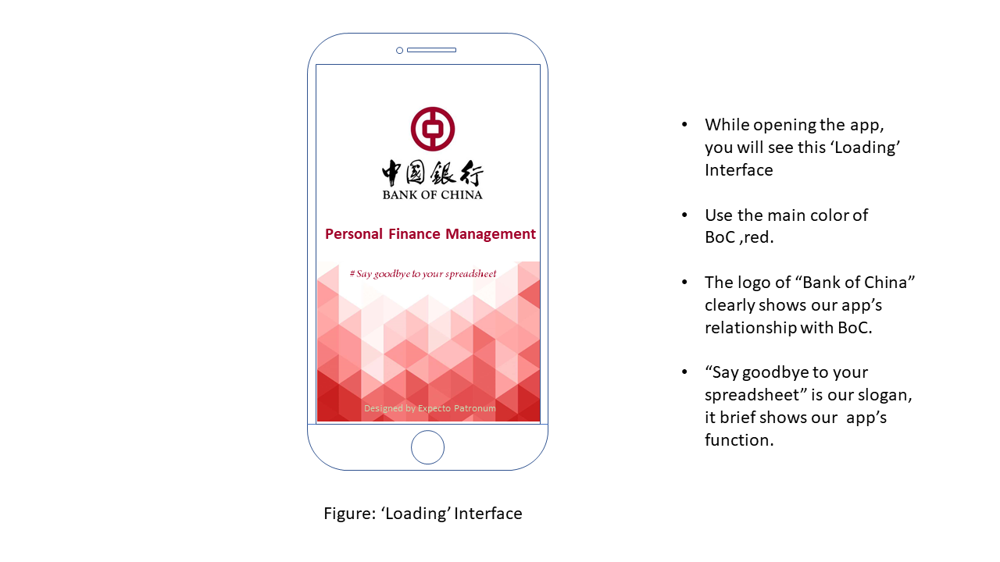

# Lab 05 Report

#If you want to see the Textual Analysis, Use Case Diagram and User Stories, [click here!](lab/lab04/Lab04_Report.md)

### Outline

- [Introduction](#introduction)
- [Distributions](#distributions)
- [User Requirement Definition](#user-requirement-definition)
- [System Specifications](#system-specifications)
- [Low-Fidelity Prototypes](#low-fidelity-prototypes )
- [Activity Diagram](#activity-diagram)
- [Context Diagram](#context-diagram)

------

### Introduction

In this week's lab,  requested by our manager Harvey, we carried on with the personal finance management for our client BoC, 

and did the specifications with some designs and plans. We achieved five objectives below:

- Make Activity Diagram and Context Diagram using Visual Paradigm;
- Draw Low-Fidelity Prototypes using Powerpoint;
- Add some notes and give reasons for our choices;
- Create this markdown report including all of our affords.
- Tag our repository at the end with tag <Lab05_Final>.

### Distributions

| No.  | Content                                                      | Main Contributor |
| ---- | ------------------------------------------------------------ | ---------------- |
| 1    | Prototypes                                                   | Ting Lou         |
| 2    | Activity Diagram& Reasoning                                  | Yanbing Luo      |
| 3    | Context Diagram& Reasoning                                   | Linglong Hu      |
| 4    | Prototypes& System Specifications&User Requirement Definition | Yixin Shen       |
| 5    | Prototypes& Documentation                                    | Gaole Dai        |

### User Requirement Definition

1. Clients owned different numbers/types of bank accounts , they can log in and manage on the APP.
2. Clients can set their own monthly fixed income and add additional income to calculate the total income.
3. Clients can classify expenditures and add new categories and types manually.

### System Specifications

N.B. Using Natural Language

   1.1 The system shall **retrieve BoC bank card data**, **know where and when the money was spent**, and **view the remaining money**.

   1.2 If the clients have multiple accounts, the system shall **log in / out of one or more different types of bank card accounts**, and **switch between different accounts to view their respective income and expenses**. 

   1.3 If the clients have multiple accounts, the system shall **generate the summary of all accounts (Generate a pie chart)**.

   1.4 If the account is Joint-account, the system shall **show who has spent the money**.

   2.1 The system shall ***set 'normal' income*** firstly.

   2.2 If the clients have additional income in this month, the system shall allow clients ***add 'extra' income***.

   2.3 The system shall **show and save the total income**, in order to **calculate the left money**.

   3.1 After the client completes a transaction, the system shall **automatically generate a type for the money based on the consumption location** and **categorize it under a certain category**.

   3.2 The system shall **set fixed categories with variable/invariant cost** and <u>after setting</u> clients should be able to **see fixed categories with variable/invariant cost**.

   3.3 If the client is not satisfied with the automatic classification of the system, the system shall allow clients **change the default category**, **add new categories** and **know how spend on different categories (Generate a pie chart)**.

   3.4 The system shall allow clients **set standard amount for 'set aside'** and **see the left money at any time**.

### Low-Fidelity Prototypes

Our prototype consists of **seven** main interfaces

-'Loading', 'Sign in/out', 'Detail', 'Charts', 'Add',  'Account' and 'Account Overview'.

*(We may adjust the main color of our interfaces to red! It's just a demo~)*

See the sequence of our application's interfaces below:

### Activity Diagram

#### Reason for choice

We choose to use activity diagram to help Harvey and Mike to understand the process and different branches of this APP, which is about personal finance management. First, users will choose their account type (three: single, multi, joint). Then according to the type they choose, they can have different actions (multi and joint have more actions). Additionally, they also have same actions: manage finance information, manage classification and manage account. For the first actions, users can check spent/left money, add 'normal' income and extra income (optional), and set standard amount. For the second, after users spent money, the APP can automatically categorized them (add to the old category/ set a new one), users also can manually change it. For the last one, users can bind/unbind and switch accounts. Throughout this activity diagram, it clearly shows me different branches and choices during this process, also include notes which explain some advantages to help people understand this app.

This is our activity diagram below:

*(It's a little bit small, sorry for the inconvenience😫)*

### Context Diagram

#### Reason for choice

We choose to use context diagram to understand how all these systems inter-relate in this BoC Personal Financed Management system. As we conceived, we have one main system, and five subsystems (include one external system). Each system does their own work. In main system, it delivers requests, receives responses and obtain some information form each subsystem. FMS is responsible for all things related to money. Including income and expenses changes in your account. AMS is responsible for bank accounts. CMS is designed to classify categories automatically and modify the categories manually, it receive data via main system and the data derives from external system BoC Database. And Customers can be classify three types as we know, and they deliver request to main system to complete all operations they wanted. Using the context diagram allows us to understand how all these systems inter-relate and make it easier to develop coding and databases.

This is our context diagram below:

#Thank you for viewing, if you want to go back to README.md [click here!](README.md)